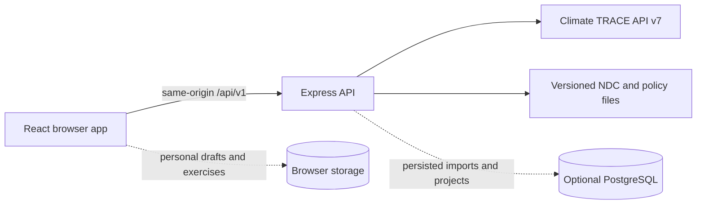

# Codebase guide

This is the maintained entry point for people who need to understand, run, review, or change the Uganda NDC Data Explorer. It explains the code that is active today, the evidence boundaries around its data, and the checks that protect those boundaries.

## 1. What the application does

The application connects three kinds of information:

1. **Official commitments:** Uganda's Updated NDC (September 2022), stored as versioned configuration.
2. **Observed emissions:** annual estimates and mapped source records requested from the public Climate TRACE API v7.
3. **User workflows:** local activity records, scenario exercises, mapped imports, and database-backed project records.

These sources are deliberately kept separate. A user-entered record never silently becomes an official target, and a located Climate TRACE source total is never presented as a complete national inventory.

## 2. Runtime at a glance



- `frontend/` is the Vite, React, and TypeScript browser application.
- `backend/server.js` starts the Express API used locally.
- `api/index.js` exposes that same Express application as a Vercel function.
- `config/` holds reviewed target definitions, category mappings, and runtime constants shared across layers.
- `shared/` holds calculations and request helpers that must behave the same in the browser and server.
- `database/` contains the optional PostgreSQL schema, migrations, and bootstrap logic.

The standalone `backend/fastapi/` service is a parallel reference implementation. It is not mounted by the Vercel deployment or the default local command.

## 3. Start the project

```sh
cp .env.example .env
npm install
npm run dev
```

The full development command validates bundled data, runs live accuracy checks, then starts the browser app on port 8080 and the API on port 8787. Use `SKIP_DEV_VERIFY=true npm run dev` only when working offline.

No site account is currently required for browsing. The country and role selectors are browser preferences. Protected import and operator actions use a separate server-issued session and remain restricted.

## 4. Directory map

| Path | Responsibility | Change with care because… |
| --- | --- | --- |
| `frontend/src/pages/` | One route-level screen per file | Pages must state when evidence is unavailable. |
| `frontend/src/components/` | Shared user-interface and workflow sections | A change can affect several routes and accessibility paths. |
| `frontend/src/components/ui/` | Accessible control primitives | These centralize focus, keyboard, and visual behavior. |
| `frontend/src/context/` | Shared application and emissions state | It controls which geography and source feed the dashboard. |
| `frontend/src/lib/` | Browser calculations, API clients, exports, and presentation rules | Unit and source-label errors can change what users infer. |
| `backend/routes/` | Public HTTP contracts under `/api/v1` | Validate inputs and preserve explicit unavailable responses. |
| `backend/services/` | Climate TRACE, document, prediction, and workflow logic | This is where upstream records become application data. |
| `backend/server/` | Express construction, middleware, health, and error handling | Local and Vercel runtimes share this code. |
| `config/` | NDC targets, sector mappings, district maps, and catalogues | Values need a named source and review date. |
| `shared/` | Cross-runtime schemas and calculations | Frontend and backend must produce the same result. |
| `database/` | Optional persistence and migrations | Migrations are append-only after deployment. |
| `scripts/` | Build, verification, and data-refresh tools | Generated outputs must remain reproducible. |
| `data/` | Versioned seeds, policy snapshots, and exports | Large machine-generated files are documented at directory level. |
| `frontend/tests/e2e/` | Browser journeys and accessibility checks | These verify behavior that unit tests cannot see. |
| `docs/` | User, engineering, deployment, and audit records | The index in `docs/README.md` identifies the canonical source for each topic. |

## 5. Main request paths

### Dashboard totals

1. `EmissionsDataContext` requests `/api/v1/emissions/dashboard`, `/timeseries`, and `/progress`.
2. `backend/routes/emissions.js` validates geography and delegates to the emissions services.
3. `backend/services/climateTraceTimeseries.js` requests strict slug-by-year series from Climate TRACE.
4. `backend/services/emissionsData.js` maps those series to the NDC sectors in `config/ndcTargets.js`.
5. `shared/progress.js` calculates a comparable status only when source scope and reporting year allow it.

A missing Climate TRACE category makes the affected sector unavailable. It is not replaced by zero and is not estimated from another category.

### Map and District Translator

The map and translator use paginated `/v7/sources` records with usable locations. Their totals describe **mapped records**, while the Dashboard uses aggregate Climate TRACE estimates. Coverage differs, so the application reports reconciliation context rather than claiming the two totals should match.

The Dashboard district selector uses 56 Climate TRACE GADM areas. District Translator uses 135 pinned 2020 UBOS boundaries. The UI names this distinction wherever the figures are shown.

### Official targets

`config/ndcTargets.js` is the server source of truth for Uganda's NDC values. Change a target only with a precise page or table reference to the official NDC document and update its verification note.

### User and operator data

- Personal activities and saved classification/scenario exercises use browser storage.
- Confirmed mapped observations and marketplace records require PostgreSQL.
- File profiling does not persist records.
- Protected writes require the operator session or a server-only API key.

## 6. Data trust rules

| Label | Meaning |
| --- | --- |
| Live | Requested from the named upstream service during use. |
| Versioned | Reviewed source material stored in this repository. |
| User supplied | Entered by a user and not automatically official. |
| Planning estimate | Calculated for exploration and not a government forecast. |
| Unavailable | Required evidence has not been connected; no substitute value is shown. |

Mock Climate TRACE mode exists for offline development only. `USE_MOCK_DATA=true` is exposed by both health endpoints and logged at startup. It must remain off in production.

For the latest completed evidence review, see [application-data-audit.md](./application-data-audit.md). For exact Climate TRACE queries and unit handling, see [climate-trace-integration.md](./climate-trace-integration.md).

## 7. Tests and release checks

```sh
npm run verify:docs
npm run lint
npx tsc --build --force
npm test
npm run build
npm run test:ux
npm run scan:secrets
```

`npm run verify:docs` requires every maintained source file to start with a plain-language purpose header and every registered browser route to appear in the in-app route directory. Generated datasets, lockfiles, caches, and binary assets are excluded because they cannot safely carry hand-written comments.

Live accuracy checks use the public network and are separate: `npm run verify:all`.

## 8. How to make a change

1. Find the owning route in `frontend/src/App.tsx` and its entry in `frontend/src/data/route-directory.ts`.
2. Follow the request from the page or context to its API route and service.
3. Identify whether each displayed value is live, versioned, user supplied, estimated, or unavailable.
4. Comment the reason for non-obvious source, unit, geography, authentication, and failure rules.
5. Update the user guide when behavior, wording, provenance, or availability changes.
6. Add a focused test for a material calculation, evidence boundary, or user journey.
7. Run the release checks above.

## 9. Commenting standard

Every maintained source file begins with a short purpose header written for a new contributor. Route files also identify the route or endpoints they own. Inline comments explain **why** a non-obvious rule exists, especially for units, missing data, geography, authentication, and provenance.

JSON, CSV, GeoJSON, lockfiles, images, PDFs, fonts, and generated exports do not support safe explanatory comments. Their schemas and provenance belong in the closest README or build script. See [code-comments.md](./code-comments.md) for examples.

## 10. Where documentation lives

- `/docs` in the application: user guide, route directory, this codebase guide, and system design.
- `README.md`: short setup and operating reference.
- `docs/README.md`: canonical documentation index.
- `docs/guide/`: user and data interpretation guidance.
- `docs/dev/`: architecture, integrations, deployment, audits, and maintainer guidance.
- File headers: the local purpose and important rules for one source file.

When two documents disagree, update both during the same change and treat the current code plus verified source contracts as the final check.
