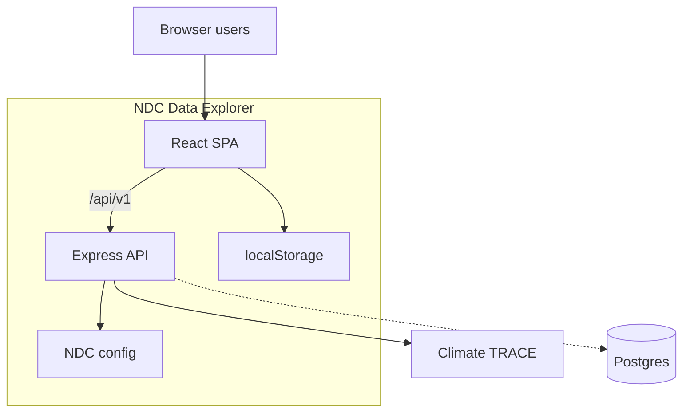
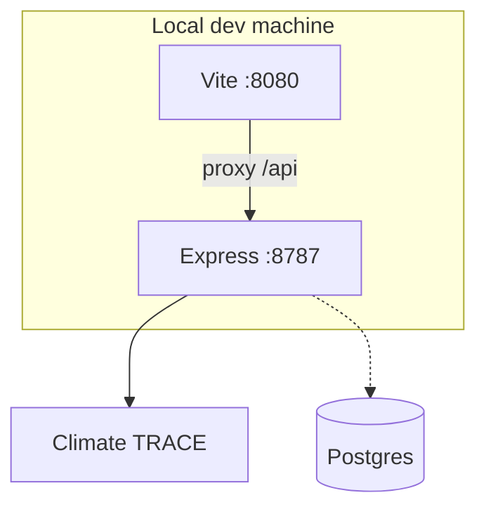
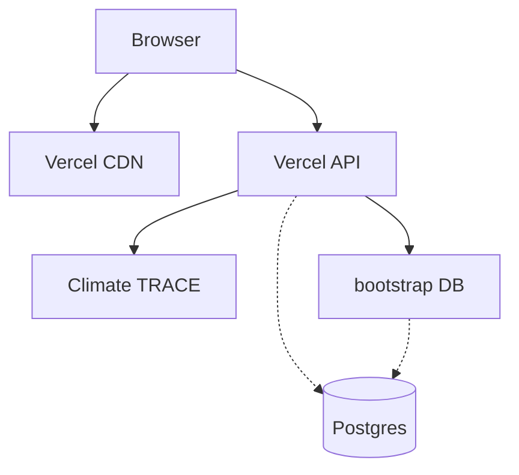
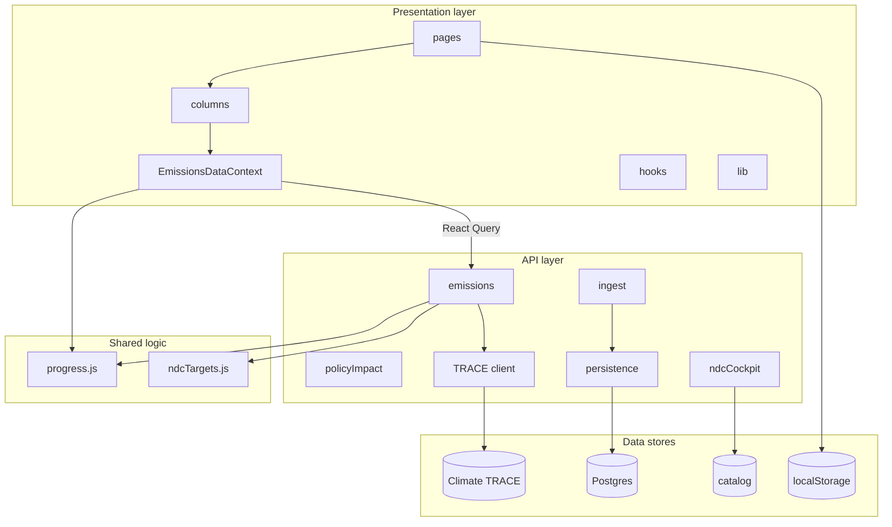
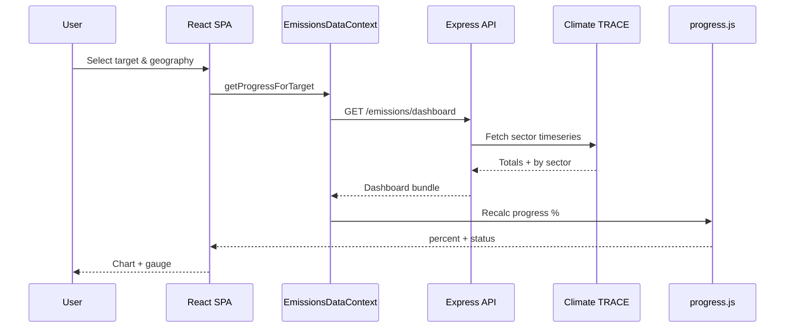
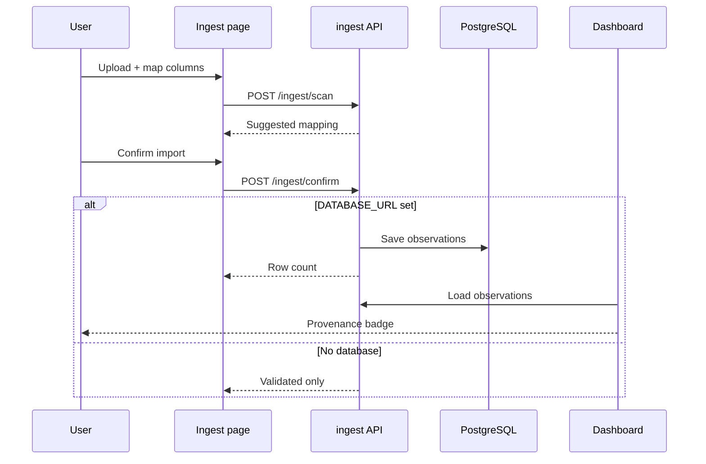
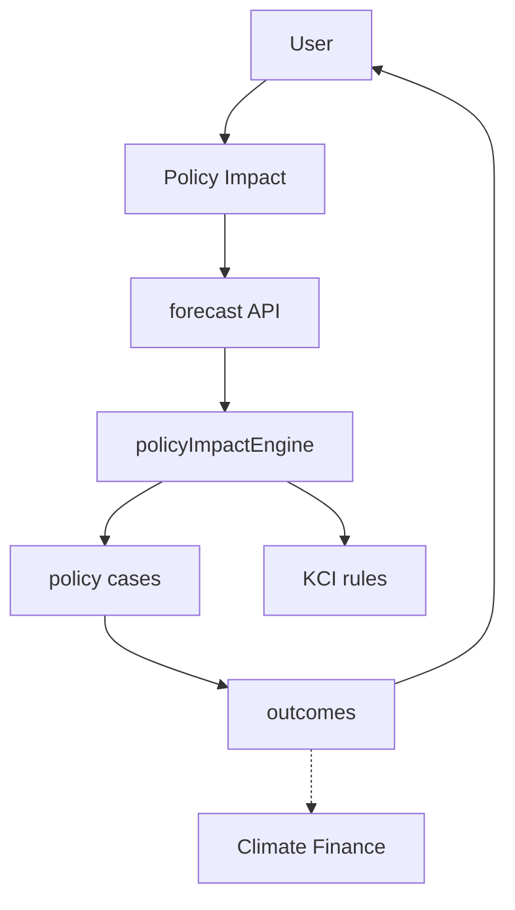
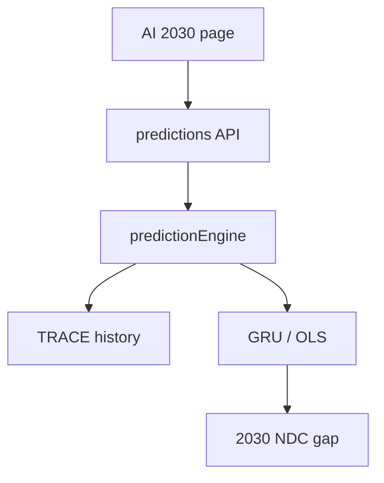
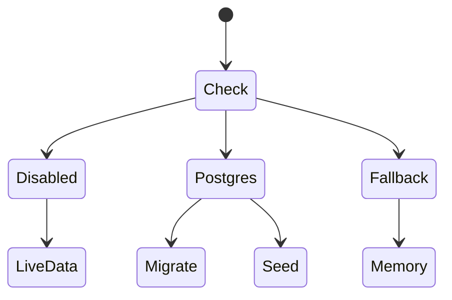
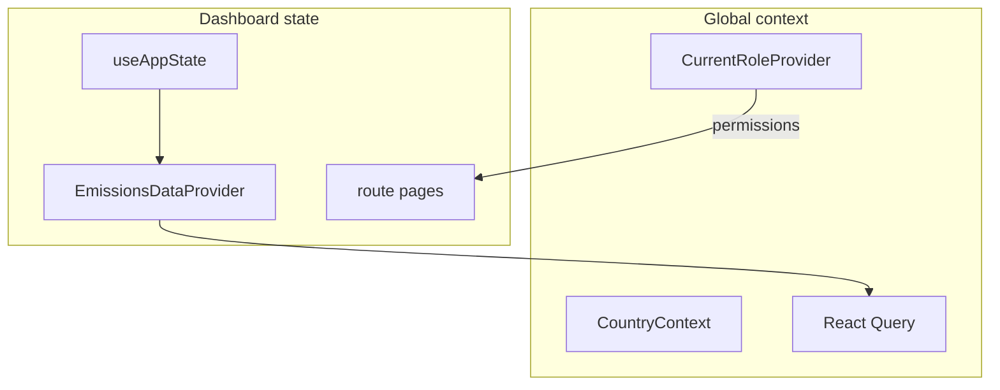

# System design — Uganda NDC Data Explorer

End-to-end architecture and workflows for the application. For file-level layout see [architecture.md](./architecture.md). For deployment see [deploy.md](./deploy.md).

---

## 1. Purpose and users

**Purpose:** Decision-support cockpit for Uganda’s climate commitments — compare official NDC targets to observed emissions, explore policy and finance options, and support MRV-style workflows (ingest, export, risk views).

**Primary users (demo roles, no real SSO):**

| Role | Typical use |
|------|-------------|
| Project developer / ministry officer | Dashboard, progress, activities |
| MRV / data officer | Ingest, evidence, exports |
| Executive / briefing | Home gap panel, PDF export |
| Finance / programme | Climate Finance, Policy Impact |

**Country scope:** Uganda is fully supported (national + 56 districts). Other countries may appear in the country gate but are not wired to live data.

---

## 2. High-level context



**Design principle:** Live emissions and progress come from **Climate TRACE**. NDC target definitions and catalog content are **versioned in the repo**. **Postgres is optional** and used mainly for **ingested observations**, not for the main dashboard MtCO₂e series.

---

## 3. Runtime topology

### 3.1 Local development



| Command | Result |
|---------|--------|
| `npm run dev` | Frontend only |
| `npm run start:api` | API only |
| `npm run dev:all` | Both (recommended) |

Environment: copy `.env.example` → `.env`. Key flags: `USE_MOCK_DATA`, `DATABASE_URL`, `USE_DB_FALLBACK`, `INGEST_API_KEY`.

### 3.2 Production (Vercel)



- SPA built from `frontend/` → served as static assets.
- `/api/*` rewritten to `api/index.js` (same Express app as local via `server/createApp.js`).
- Cold start runs `bootstrapDatabase()` when `DATABASE_URL` is set.

---

## 4. Application layers



---

## 5. Core workflows

### 5.1 Dashboard — NDC target vs observed emissions

**Entry:** `/dashboard` → `NDCLayer.tsx` → three columns (targets, observed, progress).



**Target types:**

| Type | Examples | Observed source | Progress formula |
|------|----------|-----------------|------------------|
| MtCO₂e sectors | t1 AFOLU, t4 Energy, t5 Transport | Climate TRACE sector map | BAU-cap or baseline reduction (`shared/progress.js`) |
| Economy-wide | t0 | Sum of all CT sectors | BAU-cap vs 2030 ceiling |
| Indicator panel | t2 forest, t3 MW, t8 CSA, t9 wetlands, t10 access | Indicators API / catalog | Increase toward target % |

**Geography:**

- **National:** `gadm_id=UGA` (default).
- **District:** `district=Kampala` → resolved via `config/ugandaDistrictGadm.js` (subnational from 2021).
- District view shows local TRACE series; **national NDC progress is not scored** at district level for MtCO₂e targets.

**Chart reference lines (cap targets):** Flat horizontal lines at **2030 NDC ceiling** and **2030 no-policy level** — not a rising path from 2015 inventory.

---

### 5.2 Data ingestion (mapped import)

**Entry:** `/ingest` → upload CSV/JSON → map columns → confirm.



**Requires:** `DATABASE_URL`, `INGEST_API_KEY` / `VITE_INGEST_API_KEY`.  
**Affects:** Indicator-panel targets only (not Climate TRACE MtCO₂e sectors yet).

---

### 5.3 Policy Impact forecasting

**Entry:** `/policy-impact` → wizard (objective → intervention → scenarios → results).



Rule-based **analogies** from curated KCI cases — indicative, not official government projections.

---

### 5.4 Climate Finance screening

**Entry:** `/climate-finance` (optional bridge from Policy Impact).

- Client-side economics: `frontend/src/lib/climate-finance*.ts`
- Uses mitigation options from catalog + user assumptions
- **Indicative** abatement cost / fund pathway — not tendered project finance

---

### 5.5 2030 AI prediction

**Entry:** `/ai-2030`



---

### 5.6 Emissions map

**Entry:** `/map`

- `GET /v1/emissions/map` — geolocated sources from Climate TRACE `GET /v7/sources`
- District/national via same geography params as dashboard

---

### 5.7 My Work (activities)

**Entry:** `/my-work`, activity forms

- **Persistence:** `localStorage` only (per browser)
- Catalog activities from API are read-only seeds; user captures delivery notes locally

---

### 5.8 Export

**Entry:** Dashboard export menu → `frontend/src/lib/ndc-export.ts`

| Format | Content |
|--------|---------|
| Excel | Targets, sectors, activities |
| PDF | Plain-language summary (ASCII-safe) |
| CRT/BTR CSV | MRV-oriented column layout |

Uses live `EmissionsDataContext` when API is reachable.

---

## 6. API surface (grouped)

| Group | Prefix | Responsibility |
|-------|--------|----------------|
| Health | `/v1/health`, `/v1/health/full` | Liveness, CT latency, persistence mode |
| Emissions | `/v1/emissions/*` | Dashboard, timeseries, progress, map, predictions |
| Cockpit | `/v1/indicators/panel`, `/v1/catalog/*` | Indicator targets, activities, mitigation |
| Documents | `/v1/documents/*` | Policy corpus (CPR export) |
| Policy Impact | `/v1/policy-impact/*` | Forecast + case library |
| Ingest | `/v1/ingest/*` | Scan, confirm, jobs (writes need API key) |
| Persistence | `/v1/targets/:id/observations` | Postgres-backed observations |
| Risk | `/v1/risk/*` | Illustrative seed choropleth |
| Mock | `/v1/mock/*` | Fixture mode when `USE_MOCK_DATA=true` |

Full route list: [architecture.md](./architecture.md) and `PROJECT_DOCUMENTATION.txt` Part B.

---

## 7. Persistence modes



Entry point is `bootstrapDatabase()` on API cold start (see table below).

| Mode | When | Dashboard emissions | Ingest confirm |
|------|------|---------------------|----------------|
| `postgres` | `DATABASE_URL` works | Climate TRACE | Writes to DB |
| `fallback` | `USE_DB_FALLBACK=true`, no DB | Climate TRACE + memory catalog | Limited |
| `disabled` | Default local dev | Climate TRACE | Not stored |

Postgres host (Supabase, Neon, etc.) is **only** a connection string — no Supabase SDK in app code.

**Schema:** `db/schema.ts` (Drizzle) — `targets`, `observations`, `ingest_jobs`, `audit_log`.  
**Migrations:** `drizzle/migrations/` — applied on bootstrap or `npm run db:migrate`.

---

## 8. Frontend state model



**Critical rule:** When changing sector from a target click or URL, use `setSelectedSector(..., { preserveTarget: true })` so the centre/right columns keep the selected target.

---

## 9. Shared progress engine

Single source of truth: `shared/progress.js` (used by Express API and Vite frontend).

**BAU-cap targets** (Uganda NDC 2022 — ceiling above 2015 baseline):

```
progress % = (BAU_2030 − latest) / (BAU_2030 − NDC_cap) × 100
```

**True reduction targets** (2030 target below baseline):

```
progress % = (baseline − latest) / (baseline − target) × 100
```

**Increase targets** (forest cover, access %):

```
progress % = (latest − baseline) / (target − baseline) × 100
```

Client recalculates from live API fields in `progressFromLiveApiFields` so stale `progress_pct` from an old API process does not block correct UI.

---

## 10. Security and operations

| Concern | Approach |
|---------|----------|
| Authentication | Demo only — `AuthGate` is a no-op; roles gate UI features |
| Ingest writes | `x-api-key` header (`INGEST_API_KEY`) |
| CORS | `FRONTEND_ORIGIN` allowlist |
| Rate limits | Read vs ingest-write limiters on `/v1` |
| Mock mode | `USE_MOCK_DATA=true` — fixtures, no CT calls |
| Caching | In-memory NodeCache for CT responses (24h TTL) |
| Logging | Pino HTTP + structured events |

---

## 11. External dependencies

| System | Version / note | Used for |
|--------|----------------|----------|
| Climate TRACE | API **v7** (`api.climatetrace.org/v7`) | Emissions, map sources, rankings |
| PostgreSQL | 14+ compatible | Optional ingest |
| Vercel | Serverless + static | Production hosting |
| Python (optional) | `requirements-ingest.txt` | Richer ingest scan locally; JS fallback on Vercel |

---

## 12. Repository map (quick reference)

```
ndc-data-explorer/
├── frontend/src/          React UI
├── routes/                Express routers
├── services/              Business logic (CT, predictions, policy, persistence)
├── shared/                progress.js, Zod schemas
├── config/                NDC targets, districts, catalog
├── data/                  Policy cases, documents JSON, risk seed
├── db/                    Drizzle + bootstrap + seed
├── drizzle/migrations/    SQL migrations
├── api/index.js           Vercel entry
├── server.js              Local API entry
└── docs/                  This folder
```

---

## 13. Related documents

| Document | Focus |
|----------|--------|
| [architecture.md](./architecture.md) | File paths, routes, dev proxy |
| [../guide/data.md](../guide/data.md) | Live vs indicative vs localStorage |
| [deploy.md](./deploy.md) | Env vars, Postgres on Vercel |
| [policy-engine.md](./policy-engine.md) | KCI matching detail |
| [../guide/user-guide.md](../guide/user-guide.md) | Non-technical index |
| [PROJECT_DOCUMENTATION.txt](../PROJECT_DOCUMENTATION.txt) | Full feature + API reference |

---

*Last aligned with repo structure: NDC 2022 targets, Climate TRACE v7, Drizzle Postgres ingest, client-side progress recalculation.*
