# System design — Uganda NDC Data Explorer

End-to-end architecture and workflows for the application. For file-level layout see [architecture.md](./architecture.md). For deployment see [deploy.md](./deploy.md).

---

## 1. Purpose and users

**Purpose:** Decision-support cockpit for Uganda’s climate commitments — compare official NDC targets to observed emissions, explore policy and finance options, and support MRV-style workflows (ingest, export, risk views).

**Primary users (site login temporarily disabled; roles are browser preferences):**

| Role | Typical use |
|------|-------------|
| Project developer / ministry officer | Dashboard, progress, activities |
| MRV / data officer | Ingest, evidence, exports |
| Executive / briefing | Home gap panel, PDF export |
| Finance / programme | Climate Finance, Policy Impact |

**Country scope:** Uganda is fully supported. The main dashboard maps 56 Climate TRACE GADM districts; District Translator uses a separate pinned set of 135 2020 UBOS boundaries. Other countries may appear in the country gate but are not wired to live data.

---

## 2. High-level context

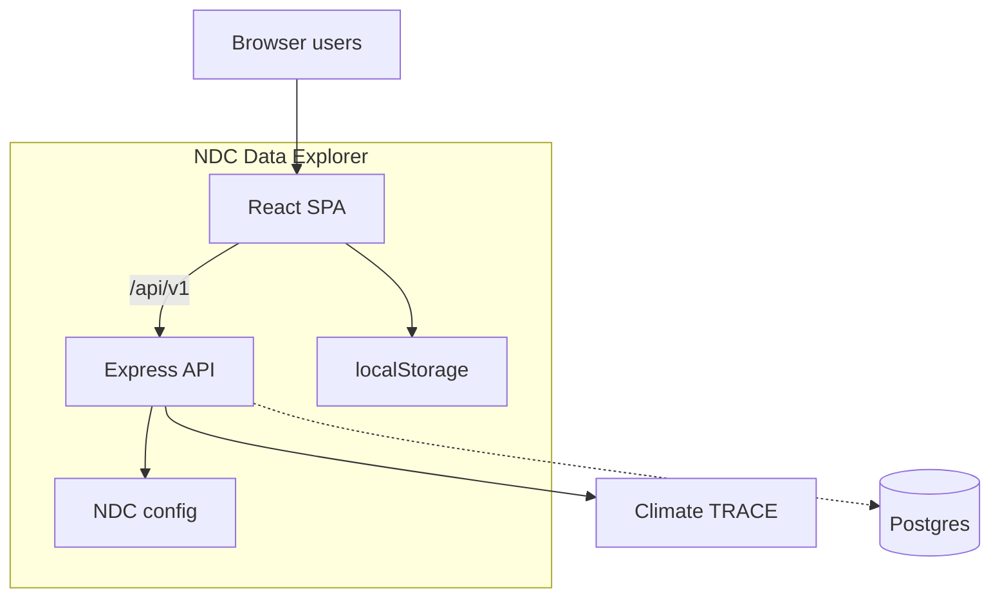
```mermaid
flowchart TB
  U[Browser users]

  subgraph App[NDC Data Explorer]
    FE[React SPA]
    API[Express API]
    CFG[NDC config]
    LS[localStorage]
  end

  CT[Climate TRACE]
  PG[(Postgres)]

  U --> FE
  FE -->|/api/v1| API
  API --> CT
  API --> CFG
  API -.-> PG
  FE --> LS
```

**Design principle:** Live emissions and progress come from **Climate TRACE**. NDC target definitions and catalog content are **versioned in the repo**. **Postgres is optional** and used mainly for **ingested observations**, not for the main dashboard MtCO₂e series.

---

## 3. Runtime topology

### 3.1 Local development

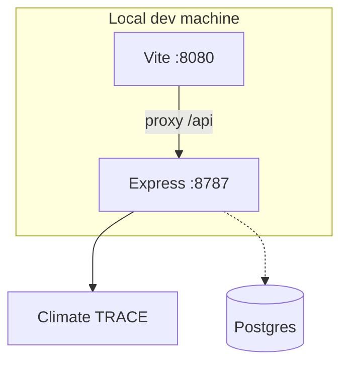
```mermaid
flowchart TB
  subgraph DevMachine[Local dev machine]
    Vite[Vite :8080]
    Express[Express :8787]
  end

  CT[Climate TRACE]
  PGlocal[(Postgres)]

  Vite -->|proxy /api| Express
  Express --> CT
  Express -.-> PGlocal
```

| Command | Result |
|---------|--------|
| `npm run dev` | Full bootstrap: environment, bundled data checks, live verifications, web and API |
| `npm run start:api` | API only |
| `npm run dev:servers` | Web and API without bootstrap verifications |

Environment: copy `.env.example` → `.env`. Key flags: `SKIP_DEV_VERIFY`, `USE_MOCK_DATA`, `DATABASE_URL`, `USE_DB_FALLBACK`, `INGEST_API_KEY`. `npm run dev` creates `.env` if missing.

### 3.2 Production (Vercel)

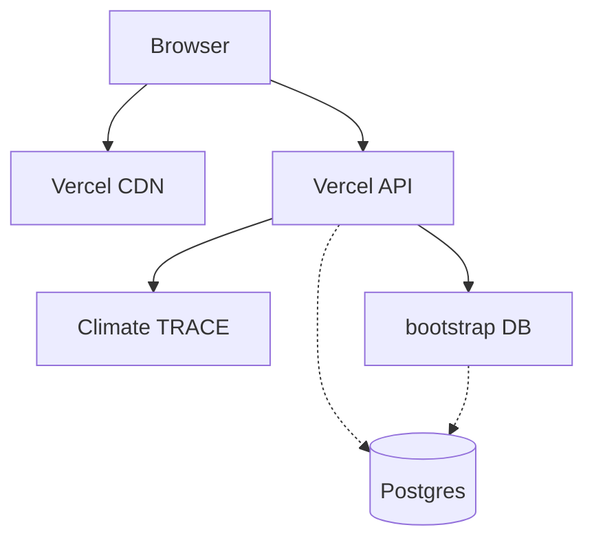
```mermaid
flowchart TB
  Browser[Browser]
  CDN[Vercel CDN]
  Fn[Vercel API]
  CT[Climate TRACE]
  PG[(Postgres)]
  Boot[bootstrap DB]

  Browser --> CDN
  Browser --> Fn
  Fn --> CT
  Fn --> Boot
  Fn -.-> PG
  Boot -.-> PG
```

- SPA built from `frontend/` and copied to `public/` by `scripts/prepare-vercel-public.mjs`.
- `/api/*` rewritten to `api/index.js` (same Express app as local via `backend/server/createApp.js`).
- Cold start runs `bootstrapDatabase()` when `DATABASE_URL` is set.

---

## 4. Application layers

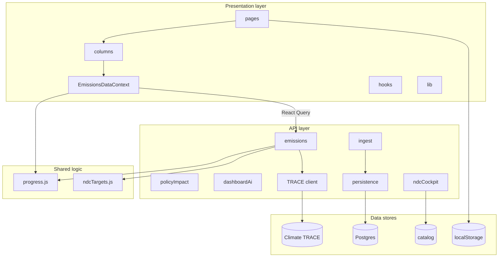
```mermaid
flowchart TB
  subgraph UI[Presentation layer]
    Pages[pages]
    Cols[columns]
    Ctx[EmissionsDataContext]
    Hooks[hooks]
    Lib[lib]
  end

  subgraph SRV[API layer]
    REm[emissions]
    RIn[ingest]
    RPi[policyImpact]
    RDAi[dashboardAi]
    RCk[ndcCockpit]
    SCT[TRACE client]
    SPers[persistence]
  end

  subgraph SH[Shared logic]
    Progress[progress.js]
    NDC[ndcTargets.js]
  end

  subgraph DST[Data stores]
    CT[(Climate TRACE)]
    PG[(Postgres)]
    Bundle[(catalog)]
    LS[(localStorage)]
  end

  Pages --> Cols --> Ctx
  Ctx -->|React Query| REm
  Ctx --> Progress
  REm --> SCT --> CT
  RIn --> SPers --> PG
  REm --> Progress
  REm --> NDC
  RCk --> Bundle
  Pages --> LS
```

---

## 5. Core workflows

### 5.1 Dashboard — NDC target vs observed emissions

**Entry:** `/dashboard` → `NDCLayer.tsx` → three columns (targets, observed, progress).

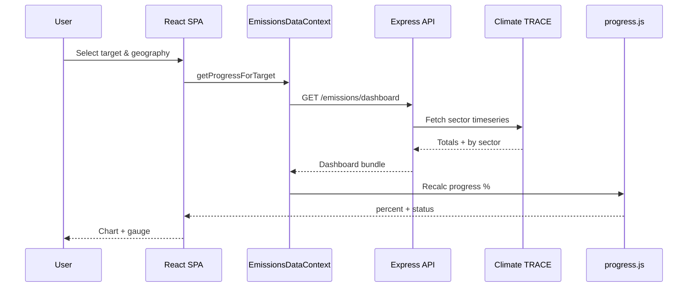
```mermaid
sequenceDiagram
  participant User
  participant SPA as React SPA
  participant Ctx as EmissionsDataContext
  participant API as Express API
  participant CT as Climate TRACE
  participant Calc as progress.js

  User->>SPA: Select target & geography
  SPA->>Ctx: getProgressForTarget
  Ctx->>API: GET /emissions/dashboard
  API->>CT: Fetch sector timeseries
  CT-->>API: Totals + by sector
  API-->>Ctx: Dashboard bundle
  Ctx->>Calc: Recalc progress %
  Calc-->>SPA: percent + status
  SPA-->>User: Chart + gauge
```

**Target types:**

| Type | Examples | Observed source | Progress formula |
|------|----------|-----------------|------------------|
| MtCO₂e sectors | t1 AFOLU, t4 Energy, t5 Transport | Climate TRACE sector map | BAU-cap or baseline reduction (`shared/progress.js`) |
| Economy-wide | t0 | Sum of all CT sectors | BAU-cap vs 2030 ceiling |
| Indicator panel | t2 forest, t3 MW, t8 CSA, t9 wetlands, t10 access | Indicators API / catalog | Increase toward target % |

**Geography:**

- **National:** `gadm_id=UGA` (default).
- **District:** `district=Kampala` → resolved via `config/ugandaDistrictGadm.js` (subnational from 2021).
- District view shows local TRACE series; **national NDC progress is not scored** at district level for MtCO₂e targets.

**Chart reference lines (cap targets):** Flat horizontal lines at **2030 NDC ceiling** and **2030 no-policy level** — not a rising path from 2015 inventory.

---

### 5.2 Data ingestion (mapped import)

**Entry:** `/ingest` opens Quick scan. Both Quick scan and Data Pipeline require an operator unlock. Data Pipeline maps and confirms CSV/JSON observations.

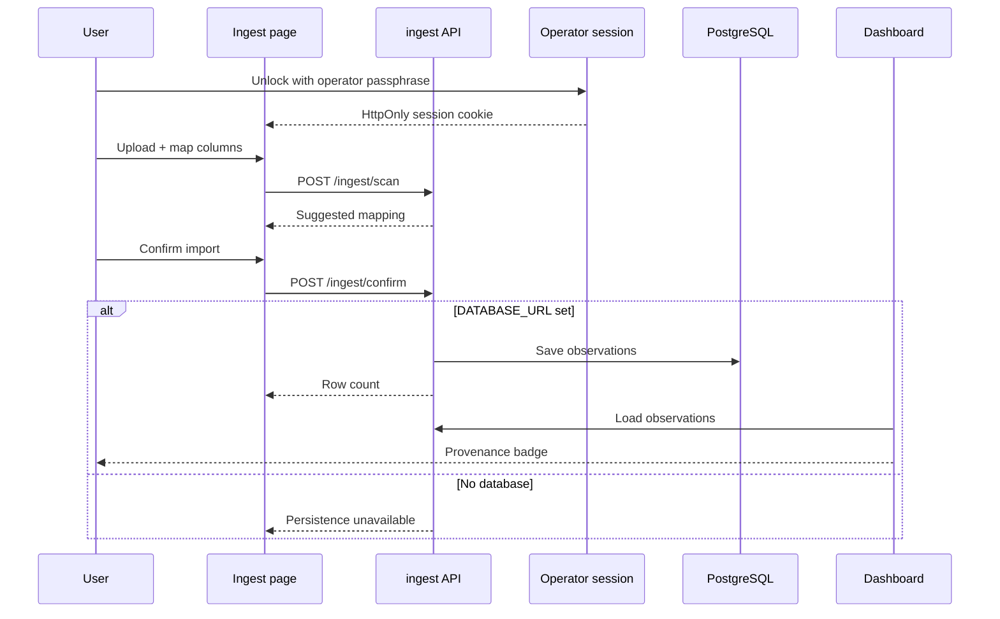
```mermaid
sequenceDiagram
  participant User
  participant SPA as Ingest page
  participant API as ingest API
  participant Auth as Operator session
  participant PG as PostgreSQL
  participant Dash as Dashboard

  User->>Auth: Unlock with operator passphrase
  Auth-->>SPA: HttpOnly session cookie
  User->>SPA: Upload + map columns
  SPA->>API: POST /ingest/scan
  API-->>SPA: Suggested mapping
  User->>SPA: Confirm import
  SPA->>API: POST /ingest/confirm
  alt DATABASE_URL set
    API->>PG: Save observations
    API-->>SPA: Row count
    Dash->>API: Load observations
    Dash-->>User: Provenance badge
  else No database
    API-->>SPA: Persistence unavailable
  end
```

**Requires:** `DATABASE_URL` for persistent mapped import and server-only `INGEST_API_KEY` for protected actions. Do not put the key in a `VITE_` variable. Quick scan profiles files but does not persist observations.
**Affects:** Indicator-panel targets only (not Climate TRACE MtCO₂e sectors yet).

---

### 5.3 Policy Impact forecasting

**Entry:** `/policy-impact` → wizard (objective → intervention → scenarios → results).

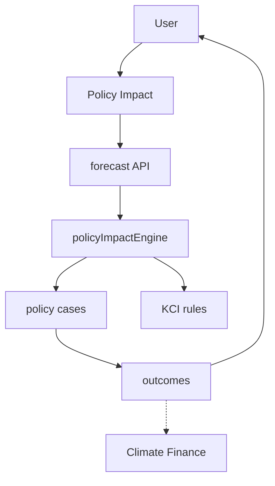
```mermaid
flowchart TB
  User[User]
  Wizard[Policy Impact]
  API[forecast API]
  Engine[policyImpactEngine]
  Cases[policy cases]
  KCI[KCI rules]
  Results[outcomes]
  CF[Climate Finance]

  User --> Wizard --> API --> Engine
  Engine --> Cases
  Engine --> KCI
  Cases --> Results
  Results --> User
  Results -.-> CF
```

No policy cases with document-specific quantitative evidence are approved for production. The route remains available, but the API returns an explicit unavailable response instead of producing an analogy from demonstration cases.

---

### 5.4 Climate Finance register

**Entry:** `/climate-finance` (optional bridge from Policy Impact).

- Contains only exact commitments checked against the provider pages for GCF FP034 and World Bank EASP P166685
- Labels the register as partial and distinguishes commitments from payments or expenditure
- Does not calculate unsupported finance gaps, abatement costs, or national totals

---

### 5.5 2030 AI prediction

**Entry:** `/ai-2030`

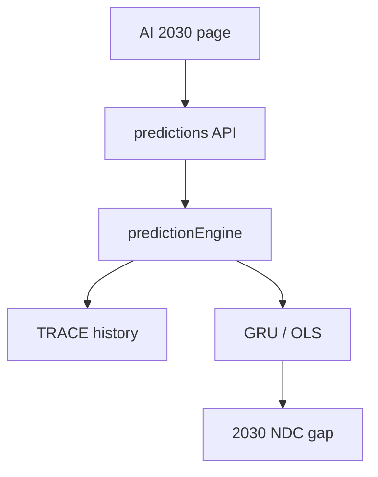
```mermaid
flowchart TB
  SPA[AI 2030 page]
  API[predictions API]
  Engine[predictionEngine]
  CT[TRACE history]
  ML[GRU / OLS]
  Gap[2030 NDC gap]

  SPA --> API --> Engine
  Engine --> CT
  Engine --> ML --> Gap
```

---

### 5.6 Emissions map

**Entry:** `/map` (primary nav: immediately after Home)

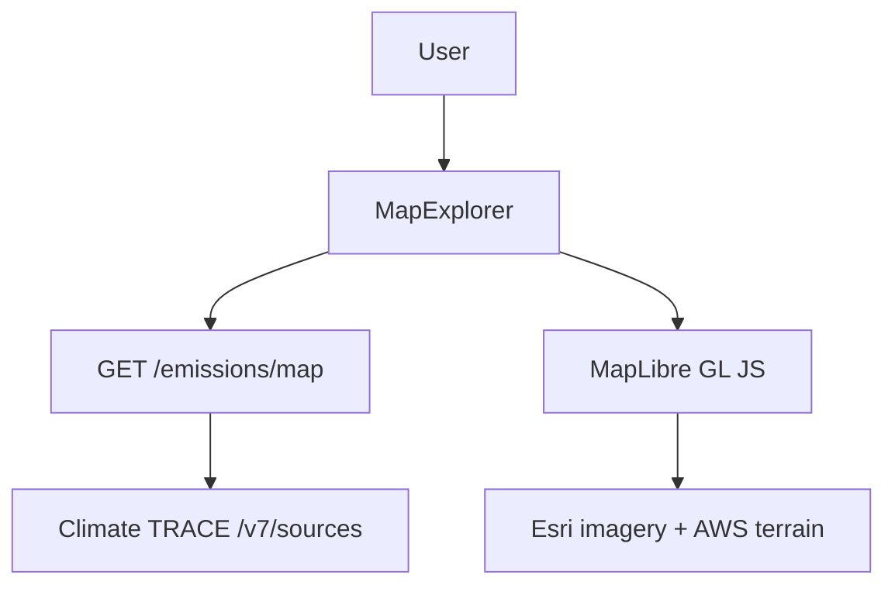
```mermaid
flowchart TB
  User[User]
  Map[MapExplorer]
  API[GET /emissions/map]
  CT[Climate TRACE /v7/sources]
  ML[MapLibre GL JS]
  Tiles[Esri imagery + AWS terrain]

  User --> Map --> API --> CT
  Map --> ML --> Tiles
```

- **Basemap:** MapLibre GL JS with Esri World Imagery + AWS terrarium DEM (no Mapbox token).
- **Rendering:** GPU circle layer (`EmissionsMap3D.tsx`) — bubble radius ∝ √emissions, colour by sector.
- **Data:** `GET /api/v1/emissions/map` wraps Climate TRACE `GET /v7/sources` (geolocated centroids).
- **Interactions:** Hover tooltip; click opens compact pinned popup (name, sector, MtCO₂e).
- **Public links:** `https://climatetrace.org/inventory?country=UGA&sector=...` (see `data-lineage.ts`).

District/national use the same geography parameters as the dashboard. The map feed is limited to 3,000 upstream rows and reports `truncated`; its `total_mtco2e` sums returned located points. The dashboard aggregate can be larger because it includes spatially uncertain emissions.

---

### 5.7 NDC AI (Dashboard)

**Entry:** `/dashboard` → **NDC AI** dialog (`DashboardAnalyzePanel.tsx`)

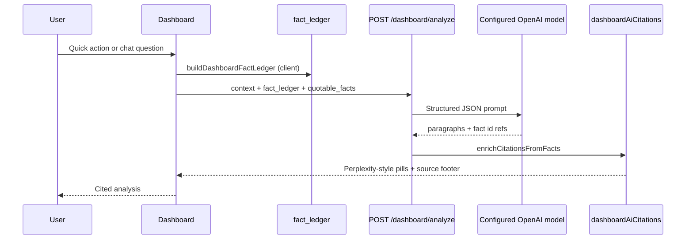
```mermaid
sequenceDiagram
  participant User
  participant SPA as Dashboard
  participant Facts as fact_ledger
  participant API as POST /dashboard/analyze
  participant OAI as Configured OpenAI model
  participant Cit as dashboardAiCitations

  User->>SPA: Quick action or chat question
  SPA->>Facts: buildDashboardFactLedger (client)
  SPA->>API: context + fact_ledger + quotable_facts
  API->>OAI: Structured JSON prompt
  OAI-->>API: paragraphs + fact id refs
  API->>Cit: enrichCitationsFromFacts
  Cit-->>SPA: Perplexity-style pills + source footer
  SPA-->>User: Cited analysis
```

**Accuracy model:**

1. Client builds `fact_ledger` from live dashboard state — each fact has `id`, `value`, `claim`, `source_url` (Climate TRACE v7 API endpoint or UNFCCC NDC PDF), and `viewer_url` (public inventory page).
2. Model is instructed to quote **only** numbers in `quotable_facts` and cite matching `fact_*` ids per paragraph.
3. Backend **deterministically** resolves citations and matches numeric claims to ledger entries; unverified numbers lower confidence.

**Requires:** `OPENAI_API_KEY`. Responses cached ~30 minutes (`dashboardAi.js`).

**Not:** web search, forecasts, or generic “dashboard” links — citations must be verifiable external URLs.

---

### 5.8 Policy documents (CPR + passages + MCF)

**Entry:** `/documents`

| Tab | Data | Build |
|-----|------|-------|
| Document library | `data/policy/documents.json` | `npm run build:documents` |
| Key documents (CPR) | `passages.json`, `topics-index.json` | `npm run build:passages` |
| Climate fund projects | `mcf-projects.json` | `npm run build:mcf` |
| Intervention pathway | `transport-theory-of-change.ts` | bundled |

Passage search is hidden until query/topic active; results group by document. Document AI (`/documents/view`) uses `backend/routes/policyAi.js` with PDF fetch and a configured OpenAI model.

---

### 5.9 My Work (activities)

**Entry:** `/my-work`, activity forms

- **Persistence:** `localStorage` only (per browser)
- Catalog activities from API are read-only policy references; user captures delivery notes locally

---

### 5.10 Export

**Entry:** Dashboard export menu → `frontend/src/lib/ndc-export.ts`

| Format | Content |
|--------|---------|
| Excel | Targets, sectors, activities |
| PDF | Plain-language summary (ASCII-safe) |
| CRT/BTR CSV | MRV-oriented column layout |

Uses live `EmissionsDataContext` when API is reachable.

---

### 5.11 District Translator and Climate TRACE source selection

`/district-translator` currently opens in **District** mode. The custom Draw control and its instructions are hidden; polygon implementation remains in the code for later use. A district picker or boundary click sends a 2020 UBOS `shapeID` to `POST /api/v1/emissions/polygon-insights`, which resolves the full server-side boundary. The browser also loads metadata, simplified display boundaries and a year-specific source layer through `/emissions/translator/*`.

The translator paginates `/v7/sources` for `gadmId=UGA`, validates and deduplicates rows, then filters centroids within the selected geometry. It reports mapped sources, sector splits, coverage, trend and exports. Administrative centroids can represent larger areas, so these totals are **not** complete territorial emissions and must not be compared directly with the dashboard's aggregate GADM district values. The selected year's pagination must complete; failed historical years are marked unavailable. See [district-translator.md](./district-translator.md) and [climate-trace-integration.md](./climate-trace-integration.md).

---

## 6. API surface (grouped)

| Group | Prefix | Responsibility |
|-------|--------|----------------|
| Health | `/api/v1/health`, `/api/v1/health/full` | Liveness, CT latency, persistence mode |
| Emissions | `/api/v1/emissions/*` | Dashboard, timeseries, progress, map, predictions, translator metadata/sources and polygon insights |
| Dashboard AI | `POST /api/v1/dashboard/analyze` | NDC AI over fact ledger (OpenAI) |
| Cockpit | `/api/v1/indicators/panel`, `/api/v1/catalog/*` | Indicator targets, activities, mitigation |
| Documents | `/api/v1/documents/*` | Policy corpus, CPR passages, MCF projects |
| Policy AI | `POST /api/v1/policy-ai/*` | PDF document analysis (OpenAI) |
| Policy Impact | `/api/v1/policy-impact/*` | Unavailable until quantitatively verified cases are approved |
| Ingest | `/api/v1/ingest/*` | Scan, confirm, jobs (writes need operator session or server key) |
| Operator session | `/api/v1/auth/session` | Inspect, unlock and lock protected browser actions |
| Persistence | `/api/v1/targets/:id/observations` | Postgres-backed observations |
| Risk | `/api/v1/risk/*` | Explicit unavailable response until a verified hazard dataset is connected |
| Mock | `/api/v1/mock/*` | Development/test fixtures only; never mounted in production |

Full route list: [architecture.md](./architecture.md) and `PROJECT_DOCUMENTATION.txt` Part B.

---

## 7. Persistence modes

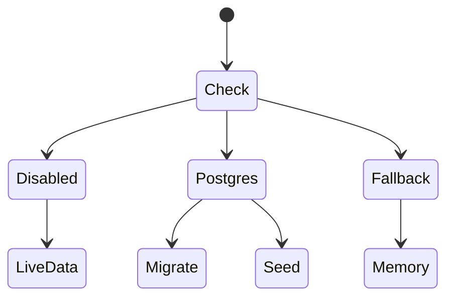
```mermaid
stateDiagram-v2
  direction TB
  [*] --> Check
  Check --> Disabled
  Check --> Postgres
  Check --> Fallback
  Postgres --> Migrate
  Postgres --> Seed
  Disabled --> LiveData
  Fallback --> Memory
```

Entry point is `bootstrapDatabase()` on API cold start (see table below).

| Mode | When | Dashboard emissions | Ingest confirm |
|------|------|---------------------|----------------|
| `postgres` | `DATABASE_URL` works | Climate TRACE | Writes to DB |
| `fallback` | `USE_DB_FALLBACK=true`, no DB | Climate TRACE + memory catalog | Limited |
| `disabled` | Default local dev | Climate TRACE | Not stored |

Postgres host (Supabase, Neon, etc.) is a database connection string. The separate Supabase Auth SDK remains in the frontend source but is disabled by `LOGIN_AUTH_ENABLED=false`.

**Schema:** `database/schema.ts` (Drizzle) — `targets`, `observations`, `ingest_jobs`, `audit_log`.
**Migrations:** `database/migrations/` — applied on bootstrap or `npm run db:migrate`.

---

## 8. Frontend state model

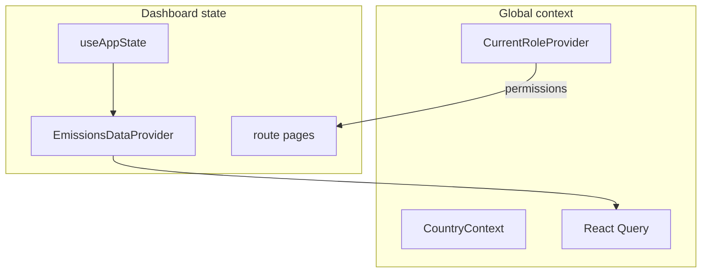
```mermaid
flowchart TB
  subgraph Global[Global context]
    Country[CountryContext]
    Role[CurrentRoleProvider]
    QC[React Query]
  end

  subgraph Dash[Dashboard state]
    AppState[useAppState]
    Emissions[EmissionsDataProvider]
    Pages[route pages]
  end

  AppState --> Emissions
  Emissions --> QC
  Role -->|permissions| Pages
```

**Critical rule:** When changing sector from a target click or URL, use `setSelectedSector(..., { preserveTarget: true })` so the centre/right columns keep the selected target.

---

## 9. Shared progress engine

Single source of truth: `shared/progress.js` (used by Express API and Vite frontend).

**BAU-cap targets** (Uganda NDC 2022 — ceiling above 2015 baseline):

```
progress % = (BAU_2030 − latest) / (BAU_2030 − NDC_cap) × 100
```

**True reduction targets** (2030 target below baseline):

```
progress % = (baseline − latest) / (baseline − target) × 100
```

**Increase targets** (forest cover, access %):

```
progress % = (latest − baseline) / (target − baseline) × 100
```

Client recalculates from live API fields in `progressFromLiveApiFields` so stale `progress_pct` from an old API process does not block correct UI.

---

## 10. Security and operations

| Concern | Approach |
|---------|----------|
| Site access | `LOGIN_AUTH_ENABLED=false` bypasses `AuthGate`, redirects `/auth` to country selection and uses `LOCAL_USER`; Supabase login code remains in source |
| Operator writes | `POST /api/v1/auth/session` exchanges an operator passphrase for an HttpOnly cookie; browser writes require a valid session and same-site origin; server jobs can use `x-api-key` |
| AI features | `OPENAI_API_KEY` required for NDC AI (`/dashboard/analyze`) and Policy document AI |
| Ingest writes | Fail closed without configured `INGEST_API_KEY`; never expose it through a `VITE_` variable |
| CORS | `FRONTEND_ORIGIN` allowlist |
| Rate limits | Read vs ingest-write limiters on `/v1` |
| Mock mode | `USE_MOCK_DATA=true` — fixtures, no CT calls |
| Caching | Country snapshot 24h; source, map and slug-year responses 1h; translator sources 1h |
| Logging | Pino HTTP + structured events |

---

## 11. External dependencies

| System | Version / note | Used for |
|--------|----------------|----------|
| Climate TRACE | API **v7** (`api.climatetrace.org/v7`) | Emissions, map sources, rankings |
| PostgreSQL | 14+ compatible | Optional ingest |
| Vercel | Serverless + static | Production hosting |
| Python (optional) | `requirements-ingest.txt` | Richer ingest scan locally; JS fallback on Vercel |

---

## 12. Repository map (quick reference)

```
ndc-data-explorer/
├── frontend/src/          React UI
├── backend/server.js       Local Express entry
├── backend/routes/         Express routers
├── backend/services/       Business logic (CT, predictions, policy, persistence)
├── shared/                progress.js, Zod schemas
├── config/                NDC targets, districts, catalog
├── data/                  Policy and document records; production demo datasets are empty or filtered
├── database/              Drizzle schema, bootstrap, seed and migrations
├── api/index.js           Vercel entry
└── docs/                  This folder
```

---

## 13. Related documents

| Document | Focus |
|----------|--------|
| [architecture.md](./architecture.md) | File paths, routes, dev proxy |
| [climate-trace-integration.md](./climate-trace-integration.md) | Upstream requests, sector mapping, reconciliation and limits |
| [district-translator.md](./district-translator.md) | Spatial source contract and boundary provenance |
| [../guide/data.md](../guide/data.md) | Live vs indicative vs localStorage |
| [deploy.md](./deploy.md) | Env vars, Postgres on Vercel |
| [policy-engine.md](./policy-engine.md) | KCI matching detail |
| [../guide/user-guide.md](../guide/user-guide.md) | Non-technical index |
| [PROJECT_DOCUMENTATION.txt](../PROJECT_DOCUMENTATION.txt) | Full feature + API reference |

---

*Last aligned: 25 September 2026 — site login disabled, District Translator drawing hidden, Climate TRACE API v7 and published data release 5.11.0 distinguished.*
